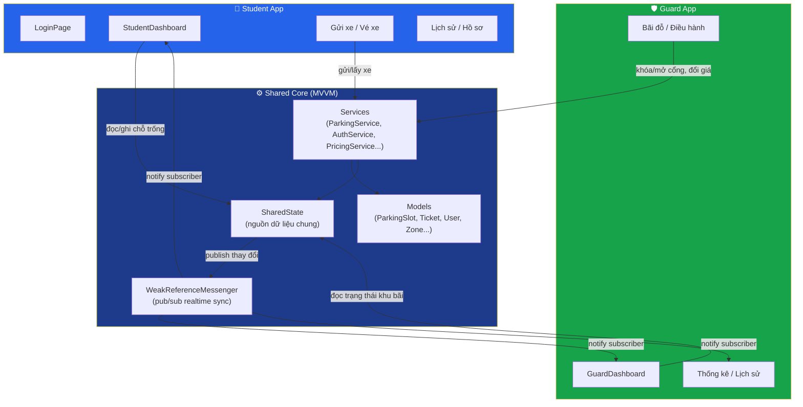
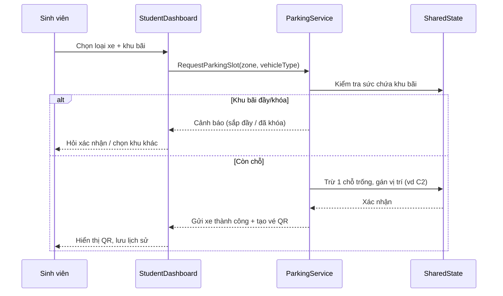

# 🚲 UTE Parking System

**Hệ thống quản lý bãi gửi xe thông minh** dành cho sinh viên và bảo vệ trường Đại học Sư phạm Kỹ thuật TP.HCM (HCMUTE), xây dựng trên .NET MAUI (C#) — hỗ trợ gửi/lấy xe bằng QR code, theo dõi sức chứa bãi xe theo thời gian thực, và bảng điều khiển vận hành cho bảo vệ.

> Đồ án nhóm môn học — phát triển bởi nhóm 5 thành viên: **Trang, Kính, Trung, Trâm, Nguyên**

---

<<<<<<< HEAD
## 📑 Mục lục

- [Tổng quan](#-tổng-quan)
- [Tính năng chính](#-tính-năng-chính)
- [Kiến trúc hệ thống](#-kiến-trúc-hệ-thống)
- [Công nghệ sử dụng](#-công-nghệ-sử-dụng)
- [Cấu trúc thư mục](#-cấu-trúc-thư-mục)
- [Demo / Screenshots](#-demo--screenshots)
- [Cài đặt & chạy thử](#-cài-đặt--chạy-thử)
- [Thành viên nhóm](#-thành-viên-nhóm)
- [Hướng phát triển](#-hướng-phát-triển)

---

## 🎯 Tổng quan

UTE Parking giải quyết bài toán quản lý bãi xe trong trường học: sinh viên cần biết bãi nào còn chỗ, gửi xe nhanh bằng QR, còn bảo vệ cần một bảng điều khiển để theo dõi sức chứa, khóa/mở cổng khẩn cấp và điều chỉnh giá vé theo thời gian thực — **đồng bộ giữa 2 ứng dụng** (Student & Guard) thông qua cơ chế `SharedState` + `WeakReferenceMessenger`.

Ứng dụng có **2 vai trò**, dùng chung 1 codebase .NET MAUI:

| Vai trò | Mục đích |
|---|---|
| 🚴 **Sinh viên** | Đăng nhập bằng MSSV, chọn loại xe & khu bãi, gửi/lấy xe bằng QR, xem lịch sử, xem hồ sơ & số dư ví |
| 🛡️ **Bảo vệ** | Theo dõi tình trạng sức chứa 4 khu bãi, khóa/mở cổng khẩn cấp, xem thống kê doanh thu, tra cứu lịch sử ra/vào theo biển số hoặc MSSV, chỉnh giá vé |

---

## ✨ Tính năng chính

### Phía Sinh viên (Student App)
- Đăng nhập bằng MSSV / mật khẩu
- Chọn loại phương tiện (Xe đạp / Xe máy) — giá vé riêng theo loại
- Chọn khu bãi (A/B/C/D) với cảnh báo real-time:
  - ⚠️ Cảnh báo "sắp đầy" khi khu bãi gần hết chỗ, cho phép chọn tiếp hoặc đổi khu khác
  - 🔒 Chặn chọn khu đang bị khóa bảo trì
- Cấp chỗ gửi xe tự động (vd: `C2 — Khu A, Hàng C, Chỗ 2`) kèm sơ đồ trực quan của khu bãi
- Xuất **vé QR** chứa đầy đủ thông tin: vị trí, biển số, giờ vào, phí dự kiến, mã SV, hạn vé 12h — có thể lưu ảnh QR
- Quét QR để **lấy xe ra**, tự tính phí theo thời gian gửi thực tế
- Lịch sử gửi xe (vào — ra — phí — trạng thái thanh toán)
- Hồ sơ cá nhân: email, trường, số dư ví

### Phía Bảo vệ (Guard App)
- Dashboard tổng quan: tổng chỗ trống, % lấp đầy, số khu bãi
- Theo dõi tình trạng sức chứa 4 khu bãi theo thời gian thực (đồng bộ tức thì với app sinh viên)
- **Điều khiển barrier khẩn cấp**: khóa/mở cổng từng khu bãi để bảo trì/điều phối
- Thống kê: doanh thu hôm nay, lượt xe, biểu đồ doanh thu theo tuần, lượng xe theo khung giờ (theo từng khu)
- Tra cứu lịch sử ra/vào bãi theo **biển số xe** hoặc **MSSV**
- Điều chỉnh bảng giá vé (xe đạp / xe máy / phí phạt vượt giờ) — đồng bộ tức thì toàn hệ thống

---

## 🏗️ Kiến trúc hệ thống



**Luồng đồng bộ real-time:** khi sinh viên gửi xe vào Khu A → `ParkingService` cập nhật `SharedState` → `WeakReferenceMessenger` phát broadcast → cả `StudentDashboard` (cập nhật số chỗ trống) và `GuardDashboard` (cập nhật % lấp đầy, thống kê) tự refresh UI ngay lập tức, **không cần gọi lại API hoặc reload màn hình**.

### Luồng gửi xe (Student)



---

## 🛠️ Công nghệ sử dụng

| Thành phần | Công nghệ |
|---|---|
| Framework | .NET MAUI (.NET 10, đa nền tảng Android/Windows) |
| Ngôn ngữ | C# (partial class theo module để 5 người làm song song) |
| Kiến trúc | MVVM, `SharedState` (state dùng chung), `WeakReferenceMessenger` (pub/sub) |
| UI | XAML, theme sáng — bảng màu mint-teal/xanh dương, card-based layout |
| QR Code | Sinh & quét QR cho vé gửi/lấy xe |
| Build mobile | `net10.0-android` (yêu cầu JDK + Android SDK qua Android Studio) |

---

## 📂 Cấu trúc thư mục

```
UTE_Parking_System/
├── Models/              # ParkingSlot, Zone, Ticket, User, PricingRule...
├── Services/            # ParkingService, AuthService, PricingService, SharedState
├── Views/               # Các trang XAML: Login, StudentDashboard, GuardDashboard...
├── Platforms/           # Cấu hình riêng theo platform (Android, Windows)
├── Resources/
│   ├── Screenshots/     # Ảnh chụp màn hình demo (xem mục Screenshots)
│   ├── Fonts, Images... 
├── Properties/
├── App.xaml / App.xaml.cs
├── AppShell.xaml / AppShell.xaml.cs
├── MainPage.xaml / MainPage.xaml.cs
├── MauiProgram.cs
└── UTE_Parking_Project.csproj
```

---

## 📸 Demo / Screenshots

> Đặt toàn bộ ảnh dưới đây vào `Resources/Screenshots/` trước khi push để các link ảnh render đúng trên GitHub.

### 🚴 Student App

| Splash & Đăng nhập | Dashboard gửi xe |
|---|---|
|   |  |

| Chọn khu bãi | Cảnh báo sắp đầy | Khu đang khóa |
|---|---|---|
|  |  |  |

| Sơ đồ khu bãi | Nhập biển số | Gửi xe thành công |
|---|---|---|
|  |  |  |

| Vé QR gửi xe | Lưu ảnh vé QR | Lịch sử gửi xe |
|---|---|---|
|  |  |  |

| QR lấy xe | Hồ sơ sinh viên |
|---|---|
|  |  |

### 🛡️ Guard App

| Bãi đỗ — tổng quan | Khóa cổng khẩn cấp |
|---|---|
|  |  |

| Thống kê doanh thu | Lượng xe theo khung giờ |
|---|---|
|  |  |

| Lịch sử (rỗng) | Điều chỉnh giá vé |
|---|---|
|  |  |

| Khu A/B khóa → SV chọn Khu D | Vé QR khu D | Tra cứu theo biển số | Tra cứu theo MSSV |
|---|---|---|---|
|  |  |  |  |

---

## 🚀 Cài đặt & chạy thử

```bash
git clone https://github.com/xuankinh/UTE_Parking_System.git
cd UTE_Parking_System

# Yêu cầu: .NET 10 SDK, MAUI workload
dotnet workload install maui

# Build & chạy trên Windows
dotnet build -t:Run -f net10.0-windows10.0.19041.0

# Build cho Android (cần Android SDK/JDK — cài qua Android Studio)
dotnet build -t:Run -f net10.0-android
```

---

## 👥 Thành viên nhóm

| Tên | Vai trò |
|---|---|
| Đinh Xuân Kính | Trưởng nhóm — StudentDashboard, GuardDashboard, đồng bộ SharedState/Messenger, fix bug zone lock/price sync |
| Trang | — |
| Trung | — |
| Trâm | — |
| Nguyên | — |

---

## 🔭 Hướng phát triển

- Tích hợp backend thật (API/DB) thay cho `SharedState` in-memory
- Thanh toán qua ví điện tử thật / liên kết ngân hàng
- Camera AI nhận diện biển số tự động tại cổng (thay quét QR thủ công)
- Thông báo push khi bãi gần đầy hoặc xe quá hạn gửi
- Dashboard thống kê nâng cao cho phòng quản lý (không chỉ bảo vệ ca trực)

---

<p align="center">UTE Parking System — Đồ án nhóm, HCMUTE 2026</p>
=======
## 👥 Phân Công Nhiệm Vụ Thành Viên

Dự án được phân chia theo các module độc lập để đảm bảo khối lượng công việc đồng đều và tối ưu hóa thế năng của từng thành viên:

| Thành viên | Phân hệ đảm nhiệm (Module) | Tệp mã nguồn (Source Code) | Chi tiết nghiệp vụ (Logic & UI) |
| :--- | :--- | :--- | :--- |
| **Trang** | **Core System & Shared Data**<br>*(Nền tảng & Dữ liệu dùng chung)* | `SplashPage.xaml.cs`<br>`LoginPage.xaml.cs`<br>`FileHandlingService.cs`<br>`SharedState.cs` | • Xử lý màn hình chờ (Splash) và giao diện Đăng nhập.<br>• Viết logic đọc dữ liệu tài khoản từ file Excel bằng thư viện `ExcelDataReader`.<br>• Quản lý Kho dữ liệu tập trung (`SharedState`), số liệu tổng và logic kiểm tra giờ hoạt động của bãi xe. |
| **Kính** | **Student App - Check-in Flow**<br>*(Phân hệ Sinh viên - Luồng Gửi xe)* | `StudentDashboard.xaml.cs`<br>*(Phần Khởi tạo & Tab 0)* | • Khởi tạo dữ liệu Sinh viên, chạy Timer đếm giờ thực và thống kê UI.<br>• Xử lý luồng tương tác: Chọn loại xe, Chọn Khu bãi (A, B, C, D) và Validate dữ liệu.<br>• Xây dựng thuật toán tự động quét và cấp phát chỗ trống (`FindNextSlot`).<br>• Lắng nghe và đồng bộ tín hiệu realtime từ Guard. |
| **Trung** | **Student App - Check-out Flow**<br>*(Phân hệ Sinh viên - Lấy xe & Lưu trữ)* | `StudentDashboard.xaml.cs`<br>*(Phần Map, Lấy xe & File)* | • Viết thuật toán vòng lặp vẽ sơ đồ ma trận bãi xe (`RenderMap`).<br>• Code luồng lấy xe: Tính toán thời gian (`TimeSpan`), chốt phí và giải phóng chỗ đỗ.<br>• Render giao diện thẻ Lịch sử (`AddHistoryCard`).<br>• Xử lý lưu phiên gửi xe ngầm (`Preferences`) và xuất mã QR ra file ảnh vật lý. |
| **Trâm** | **Guard App - Monitoring**<br>*(Phân hệ Bảo vệ - Giám sát bãi xe)* | `GuardDashboard.xaml.cs`<br>*(Phần Map & Tìm kiếm)* | • Code thuật toán sinh sơ đồ bản đồ động giám sát cho Bảo vệ (`RenderMap`).<br>• Viết thuật toán lọc và tìm kiếm xe rẽ nhánh (Tìm theo Biển số hoặc Vị trí).<br>• Xử lý logic gạt công tắc Khóa/Mở bãi khẩn cấp (`LockToggle`) để điều phối luồng xe của toàn hệ thống. |
| **Nguyên** | **Guard App - Dashboard**<br>*(Phân hệ Bảo vệ - Thống kê & Cấu hình)* | `GuardDashboard.xaml.cs`<br>*(Phần Stats, Timer & Cấu hình)* | • Dựng thuật toán sinh UI dạng lưới cho Bảng lượng xe theo 17 khung giờ (`BuildHourlyTable`).<br>• Xử lý mô phỏng doanh thu và phân bổ tỷ lệ xe ảo tự động chạy ngầm.<br>• Viết logic kiểm tra giờ hệ thống để tự động đóng/mở bãi (`CheckAutoLockByTime`).<br>• Cấu hình giá vé và quản lý logic của Class Model UI (`ZoneItem`). |

---
*Ghi chú: Toàn bộ logic giao diện động (Dynamic UI) đều được xử lý trực tiếp bằng mã C# Code-Behind để đảm bảo khả năng tùy biến dữ liệu theo thời gian thực.*
>>>>>>> e7e1cff57d0d5fb216ab17422c91636f13551ee2
